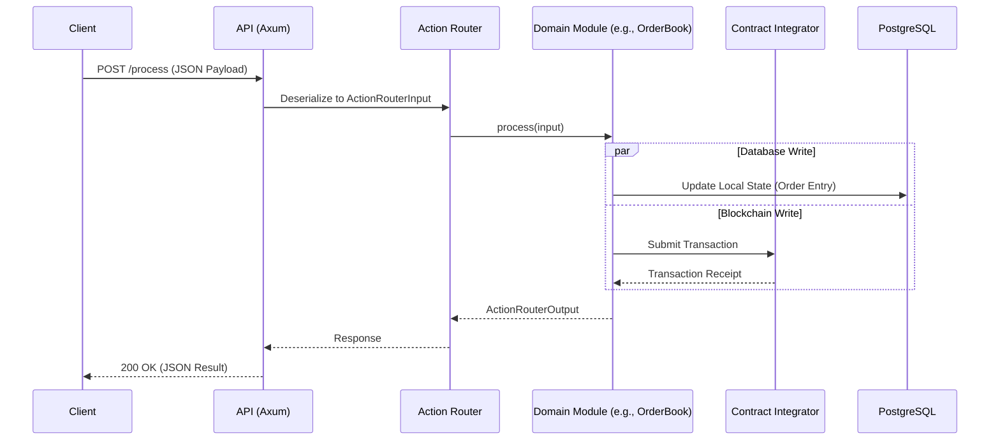
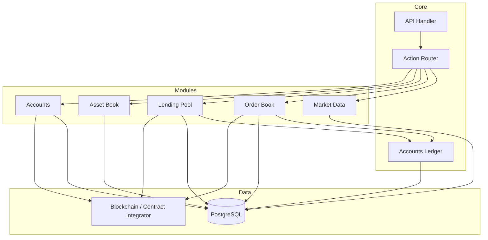
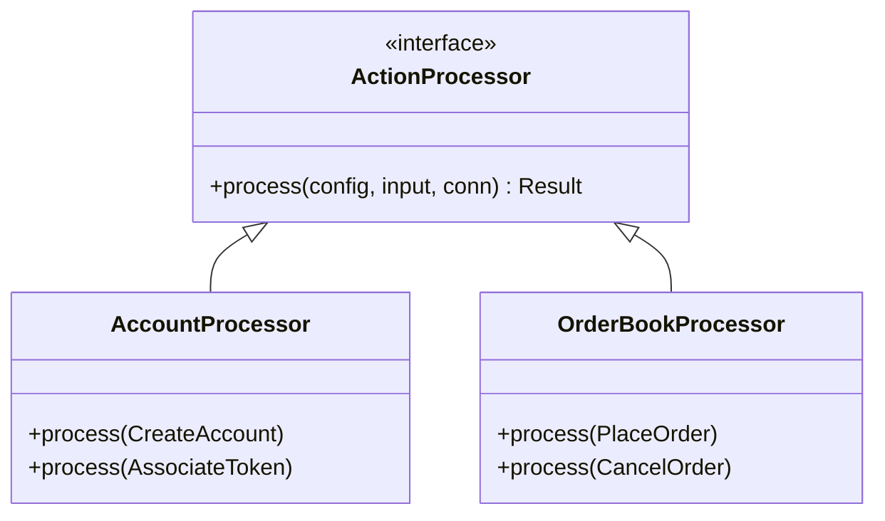

# Cradle Backend Architecture

## Overview

The Cradle Backend is a modular Rust application designed to handle financial operations, market data processing, and blockchain interactions for the Cradle protocol. It uses a clean, processor-pattern architecture where specific domain logic is encapsulated in modules, dispatched via a central router, and backed by PostgreSQL and the `contract-integrator` package for on-chain operations.

## System Components

### 1. API Layer (`src/api`)
The entry point for external communication, built with **Axum**.
- **Handlers**: Specific endpoint logic (e.g., `/accounts`, `/process`, `/health`).
- **Middleware**: Authentication (`validate_auth`) and processing.
- **Router**: Defines HTTP routes and connects them to handlers.
- **Socket.io**: Handles real-time events (tickers, order updates) in `src/sockets.rs`.

### 2. Core Processing Engine
The core logic follows a **Command Processor Pattern**.
- **Action Router (`src/action_router.rs`)**: The central dispatcher. It receives polymorphic `ActionRouterInput` requests (enums), determines the target module, and invokes the appropriate `process` method.
- **Action Processor Trait**: Defines the standard interface (`process`) that all domain modules must implement.

### 3. Data & Integration Layer
- **PostgreSQL (Diesel)**: The primary persistent store. Each module manages its own schema tables (defined in `migrations/` and `src/schema.rs`).
- **Contract Integrator**: An external package (`contract-integrator`) owned by the organization. It handles:
    - Transaction submission to the blockchain (Hedera).
    - Request/Response serialization & deserialization.
    - Smart contract interfaces.

---

## Domain Modules

The `src` folder is organized into domain-specific modules, each containing its own configuration (`config.rs`), database types (`db_types.rs`), and business logic (`processor.rs`, `operations.rs`).

### 1. Accounts (`src/accounts`)
**Responsibility**: Manages the lifecycle of user accounts and wallets.
- **Key Operations**: `CreateAccount`, `AssociateToken`, `DeleteAccount`.
- **Interactions**: Calls `contract-integrator` to create on-chain accounts or associate tokens with wallets.

### 2. Accounts Ledger (`src/accounts_ledger`)
**Responsibility**: A shared audit/history ledger for financial transactions.
- **Usage**: Used by `lending_pool`, `order_book`, and `listing` to record events like Deposits, Withdrawals, Trades, and Liquidations.
- **Note**: It acts primarily as a library for other modules to insert immutable transaction records.

### 3. Asset Book (`src/asset_book`)
**Responsibility**: The registry of supported assets (tokens).
- **Function**: Maintains metadata for tokens (Ticker, Decimals, Contract IDs) allowed on the platform.

### 4. Lending Pool (`src/lending_pool`)
**Responsibility**: Handles DeFi lending protocol operations.
- **Key Operations**: `Deposit`, `Borrow`, `Repay`, `Liquidate`.
- **Oracle**: Contains an `oracle` submodule for price feeds required for collateralization checks.

### 5. Order Book (`src/order_book`)
**Responsibility**: Manages the trading engine and order states.
- **Key Operations**: Placing and cancelling orders (`Limit`, `Market`).
- **Integration**: Likely triggers on-chain settlement via `contract-integrator` and records trades in `accounts_ledger`.

### 6. Listing (`src/listing`)
**Responsibility**: Manages native listings (likely specific assets or instruments listed directly on Cradle).
- **Operations**: Creating and managing the lifecycle of these listings.

### 7. Market & Market Time Series (`src/market`, `src/market_time_series`)
**Responsibility**: Data aggregation and analytics.
- **Market**: Handles current market state (best bid/ask, last price).
- **Market Time Series**: Manages historical data (OHLCV candles) for charting.
- **Aggregators**: Internally uses `src/aggregators` (implied) to process raw events into time buckets.

### 8. Ramper (`src/ramper`)
**Responsibility**: Fiat On-Ramp Integration.
- **Function**: Handles webhooks and API calls to/from the Ramper service to facilitate fiat-to-crypto conversion and wallet funding.

---

## Architecture Diagrams

### High-Level Request Flow
A standard mutation request flow (e.g., executing a trade).

### Module Dependency Graph
Relationship between the main backend components.

### Processor Pattern Structure
Each module follows this internal structure for consistency.

