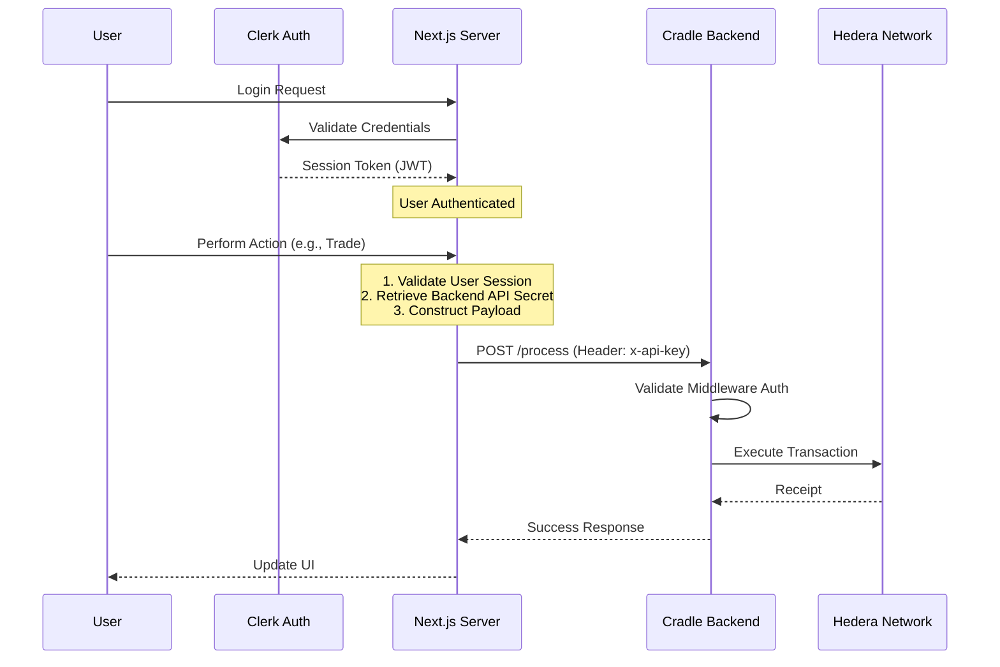
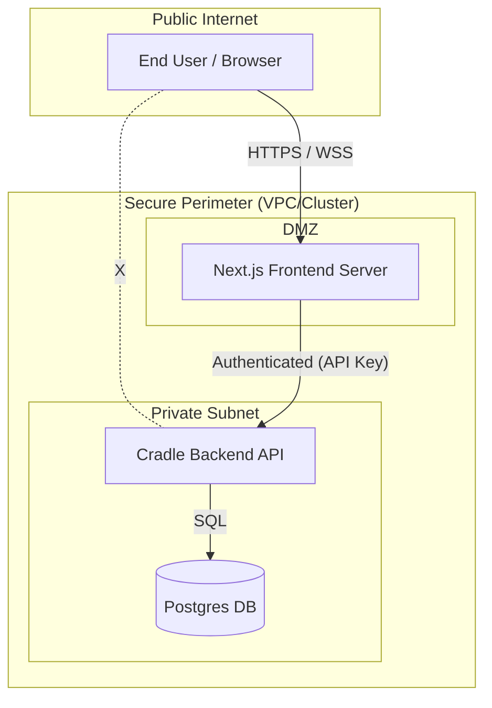

# Cradle Backend Security Model

## Overview

This document outlines the security architecture of the Cradle platform. The system is designed with a trusted-middleware model where the Cradle Backend operates as a protected service layer, accessible only by authorized upstream servers, not directly by end-user clients.

## Trust Architecture

The current deployment model assumes a **Trusted Client** relationship between the Frontend Server (Next.js) and the Cradle Backend.

*   **Users** authenticate with the Frontend (via Clerk).
*   **Frontend** holds the custody of API secrets.
*   **Backend** trusts the Frontend to have performed user authentication and authorization.

### 1. Authentication Flow

End users do not interact directly with the Cradle Backend or the Blockchain. The Next.js frontend acts as the custodian of the user session and the bridge to the backend.

### 2. Network Security Perimeter

The backend is isolated from public internet traffic. Access is restricted using network-level controls and application-level secrets.

## Security Controls

### Application Layer
*   **API Secret Authentication**: The backend enforces strict authentication via `x-api-key` headers. This key is stored securely on the Next.js server side environment and is never exposed to the client browser.
*   **Clerk Integration**: User identity management, password storage, and 2FA are offloaded to Clerk, reducing the attack surface on the Cradle infrastructure.
*   **Wallet Abstraction**: Users do not manage private keys for protocol interaction. The architecture implies a custodial or semi-custodial model where the system manages the complexity of blockchain interactions on behalf of the web2-style user.

### Future Considerations: Multi-Tenancy
*   **Current State**: The system currently operates in a single-tenant mode, serving only the official Cradle frontend.
*   **Development Roadmap**: Support for multi-tenancy (allowing third-party integrators to build on top of Cradle Backend) is under development. This will require:
    *   Granular API Key management per tenant.
    *   Scoped resource access (Data segregation by Tenant ID).
    *   Rate limiting per tenant.

## Data Privacy & Integrity
*   **Ledger Immutability**: Critical financial events are recorded in the `accounts_ledger` tables, which serve as the source of truth for user balances and specific audit trails.
*   **On-Chain Verification**: Settlements and asset movements are executed on the Hedera network, providing a public, immutable proof of transaction that can be reconciled against the internal database.
